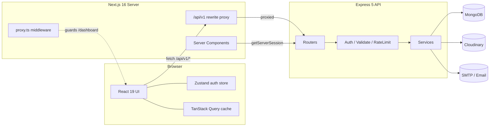
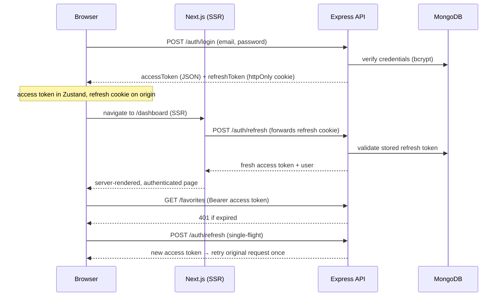

<div align="center">

# 🏠 Estatein — Full-Stack Real Estate Platform

A production-grade real estate marketplace with a public listings experience, a role-based dashboard, and a fully data-driven admin CMS — built end-to-end with **Next.js 16**, **Express 5**, **TypeScript**, and **MongoDB**.

[](https://www.typescriptlang.org/)
[](https://nextjs.org/)
[](https://react.dev/)
[](https://expressjs.com/)
[](https://www.mongodb.com/)
[](https://tailwindcss.com/)
[](https://tanstack.com/query)

</div>

---

## 📑 Table of Contents

- [Overview](#-overview)
- [Why Recruiters Should Pay Attention](#-why-recruiters-should-pay-attention)
- [Key Features](#-key-features)
- [Technology Stack](#-technology-stack)
- [System Architecture](#-system-architecture)
- [Project Structure](#-project-structure)
- [Core Technical Highlights](#-core-technical-highlights)
- [Engineering Decisions](#-engineering-decisions)
- [Security](#-security)
- [API Overview](#-api-overview)
- [Installation Guide](#-installation-guide)
- [Environment Variables](#-environment-variables)
- [Screenshots](#-screenshots)
- [Future Improvements](#-future-improvements)
- [Why This Project Stands Out](#-why-this-project-stands-out)
- [Skills Demonstrated](#-skills-demonstrated)
- [Code Quality](#-code-quality)

---

## 🔎 Overview

**Estatein** is a full-stack real estate platform where visitors can browse, search, and filter property listings, save favourites, submit inquiries, and read a company blog — while administrators manage the entire catalogue (properties, categories, blog posts, testimonials, users, inquiries, and contact messages) through a dedicated dashboard with analytics.

**What problems it solves**

- Gives a real estate business a single system to **publish listings** and **capture leads** (inquiries, contact messages, newsletter sign-ups).
- Provides customers with a fast, modern browsing experience featuring **search, multi-facet filtering, sorting, and pagination**.
- Gives operators a **role-based admin CMS** with charts and moderation tools instead of editing data by hand.

**Who it's built for**

- End users browsing and shortlisting properties.
- Administrators managing inventory, content, and customer leads.

**Key business value** — every piece of content on the site is served from the backend (single source of truth). There is **no hardcoded catalogue data on the frontend**, so the entire application can be re-themed or re-seeded without touching UI code.

---

## 🎯 Why Recruiters Should Pay Attention

> A concise snapshot of the strongest engineering signals in this repository.

- **End-to-end type safety** — TypeScript in strict mode across both apps, with a shared API response contract (`ApiSuccess<T>` / `ApiFailure`) mirrored on client and server.
- **Modular, layered backend** — every domain is a self-contained module (`model → service → controller → routes → validation`), making the codebase scalable and easy to reason about.
- **Production-grade authentication** — JWT access tokens + non-rotating refresh tokens in `httpOnly` cookies, with a single-flight refresh mechanism and server-side session resolution inside Next.js Server Components.
- **Security-first defaults** — Helmet, credentialed CORS, tiered rate limiting, bcrypt password hashing (12 rounds), Zod input validation, and hashed single-use password-reset tokens.
- **Resilient runtime** — centralized error normalization, `catchAsync` wrapping, graceful shutdown, and process-level rejection/exception handling.
- **Real data, real analytics** — a comprehensive seed script populates ten collections with historically-distributed timestamps so dashboard charts show genuine trends.
- **Thoughtful UX** — App Router with SSR-resolved auth, optimistic client caching via TanStack Query, dark mode, accessible Radix primitives, and responsive design.

---

## ✨ Key Features

<details open>
<summary><b>Frontend Features</b></summary>

- Server-rendered public pages (home, listings, property detail, blog, about, contact, FAQ, testimonials, legal pages).
- Property discovery with **full-text search, faceted filters** (purpose, type, category, city, price range, bedrooms, status), **sorting**, and **pagination**.
- Property detail pages with image galleries, specifications, amenities, related properties, reviews, and an inquiry form.
- Company **blog** with slugged article pages and tag support.
- **Dark / light theme** with system preference detection (`next-themes`).
- Animations via `framer-motion`, carousels via `embla-carousel`, and charts via `recharts`.
- Fully responsive, accessible UI built on Radix primitives.
</details>

<details>
<summary><b>Backend Features</b></summary>

- RESTful API (`/api/v1`) organized into 13 feature modules.
- CRUD for properties, categories, blog posts, testimonials, reviews, favourites, inquiries, contacts, and users.
- **Search, filtering, sorting, and pagination** at the database layer.
- Automatic, collision-resistant **slug generation** for properties and blogs.
- **Image upload pipeline** to Cloudinary via Multer, with old-asset cleanup on update/delete.
- Transactional **email** (password reset) via Nodemailer.
- **Analytics aggregation** endpoints powering the dashboard charts.
- Full **database seeding** with realistic, historically-distributed demo data.
</details>

<details>
<summary><b>Authentication Features</b></summary>

- Email/password registration and login.
- JWT **access tokens** + **refresh tokens** persisted server-side and delivered as `httpOnly` cookies.
- Silent access-token refresh with **single-flight de-duplication** and automatic one-time retry on `401`.
- **Forgot / reset password** flow with hashed, single-use, 1-hour-expiry tokens and branded emails.
- Session resolution inside **Next.js Server Components** by forwarding the refresh cookie.
- Provider-aware user model (`credentials` / `google`) ready for OAuth expansion.
</details>

<details>
<summary><b>Admin Features</b></summary>

- Dedicated `/dashboard/admin` area guarded by role-based access control.
- Manage properties (create/edit with multi-image upload), categories, blog posts, and testimonials.
- **Moderate** testimonials and triage inquiry / contact statuses (`new → contacted/read → closed/resolved`).
- User management (list, view, delete).
- Analytics dashboard: overview KPIs, properties-per-month, inquiries-over-time, properties-by-type, and properties-by-status charts.
</details>

<details>
<summary><b>User Features</b></summary>

- Personal dashboard with saved **favourites** and submitted **inquiries**.
- Profile management (name, phone, **avatar upload**) and password change.
- Post reviews with star ratings on properties.
</details>

<details>
<summary><b>Security Features</b></summary>

- Helmet security headers, credentialed CORS locked to the client origin.
- **Three-tier rate limiting** (auth, public forms, global baseline).
- bcrypt password hashing (12 salt rounds) with `select: false` on sensitive fields.
- Zod validation on body / query / params for every mutating endpoint.
- Role-based authorization middleware.
</details>

<details>
<summary><b>Performance Features</b></summary>

- Response `compression` (gzip) on the API.
- MongoDB **indexes** (text index + compound indexes) tuned for search and featured queries.
- Client-side caching and request de-duplication via TanStack Query.
- `next/image` optimization with a custom Cloudinary loader.
- Bounded pagination (max 100 per page) to protect the database.
</details>

<details>
<summary><b>Developer Experience Features</b></summary>

- Strict TypeScript, path aliases (`@/*`), and ESLint on both apps.
- `typecheck`, `lint`, `build`, `dev`, and `seed` npm scripts.
- Hot reload via `nodemon` + `ts-node` (server) and Next.js Fast Refresh (client).
- Consistent API envelope and centralized error handling for predictable debugging.
</details>

---

## 🧱 Technology Stack

| Category | Technologies |
|---|---|
| **Frontend Framework** | Next.js 16 (App Router), React 19 |
| **Backend Framework** | Node.js, Express 5 |
| **Language** | TypeScript 5.6 (strict mode, both apps) |
| **Database & ODM** | MongoDB, Mongoose 8 |
| **Authentication** | JSON Web Tokens (`jsonwebtoken`), bcrypt, `httpOnly` cookies, `google-auth-library` |
| **State Management** | Zustand (persisted auth store), TanStack Query v5 (server state) |
| **Forms & Validation** | React Hook Form + `@hookform/resolvers`, Zod (shared client & server) |
| **UI Primitives** | Radix UI (Dialog, Dropdown, Select, Tabs, Toast, Accordion, Label, Slot) |
| **Styling** | Tailwind CSS v4, `class-variance-authority`, `tailwind-merge`, `clsx` |
| **Data Visualization** | Recharts |
| **Animation & Media** | Framer Motion, Embla Carousel, `lucide-react` icons, `next-themes` |
| **File Upload & Storage** | Multer, `multer-storage-cloudinary`, Cloudinary |
| **Email** | Nodemailer (SMTP) |
| **Security & Middleware** | Helmet, CORS, `express-rate-limit`, `cookie-parser`, Morgan, Compression |
| **Utilities** | `slugify` |
| **Build & Dev Tools** | `tsc`, `nodemon`, `ts-node`, ESLint, PostCSS, Autoprefixer |

---

## 🏗 System Architecture

Estatein is a **decoupled two-tier application**: a Next.js frontend and an Express REST API, communicating over a same-origin proxy so that the `httpOnly` refresh cookie is stored on the Next.js origin and remains readable by Server Components.

### High-level topology



### Backend architecture (layered + modular)

Each feature is an isolated module following the same layered contract, enforcing **separation of concerns**:

```
Request → Router → [ authenticate → authorize → parseMultipartJson → validate ] → Controller → Service → Mongoose Model → MongoDB
                                                                                      │
                                                                    ApiResponse ◄─────┘
Errors ─────────────────────────────► catchAsync ──► central errorHandler ──► standard ApiFailure
```

- **Routers** declare endpoints and compose middleware.
- **Middleware** handles cross-cutting concerns (JWT verification, RBAC, multipart JSON parsing, Zod validation, rate limiting).
- **Controllers** are thin — they translate HTTP ↔ service calls and wrap logic in `catchAsync`.
- **Services** hold business logic and are the only layer that touches Mongoose models.
- **Models** define schemas, indexes, hooks (password hashing, slug generation), and instance methods.

### Authentication flow



### Request lifecycle & component communication

- **Public data** is fetched server-side (`server-fetch.ts`) directly from the backend origin for fast, SEO-friendly SSR.
- **Authenticated/interactive data** flows through `api-client.ts` (browser) via the same-origin `/api/v1` proxy, with automatic token injection and refresh-on-401.
- **Route protection** happens in Next.js middleware (`proxy.ts`): unauthenticated visitors to `/dashboard/*` are redirected to `/login?redirectTo=…`, and logged-in users are bounced away from `/login` and `/register`.

---

## 📂 Project Structure

```
estatein/
├── client/                         # Next.js 16 frontend (App Router)
│   └── src/
│       ├── app/                    # Routes: public pages, auth, dashboard, admin
│       │   ├── dashboard/          # User dashboard + admin CMS (nested layouts)
│       │   ├── properties/         # Listing + detail routes
│       │   ├── blog/               # Blog list + article routes
│       │   └── ...                 # about, contact, faq, login, register, etc.
│       ├── components/
│       │   ├── layout/             # Navbar, Footer, MobileNav, ProfileDropdown
│       │   ├── sections/           # Home sections (Hero, Featured, Stats, FAQ…)
│       │   ├── shared/             # Pagination, SearchBar, Empty/Error states
│       │   └── ui/                 # Design-system primitives (button, card, dialog…)
│       ├── modules/                # Feature slices (auth, blog, dashboard, newsletter)
│       │   └── <feature>/          # api.ts, schema.ts, hooks/, components/
│       ├── lib/                    # api-client, auth (SSR), server-fetch, utils, constants
│       ├── store/                  # Zustand auth store (persisted)
│       ├── providers/              # Query, Theme, Auth providers
│       ├── hooks/                  # useDebounce, useMediaQuery, useQueryParams
│       ├── types/                  # Shared domain + API contract types
│       └── proxy.ts                # Next.js middleware (route protection)
│
└── server/                         # Express 5 REST API
    └── src/
        ├── config/                 # env (Zod-validated), db, cloudinary
        ├── middleware/             # authenticate, authorize, validateRequest,
        │                           # rateLimiter, errorHandler, notFound, parseMultipartJson
        ├── modules/                # Feature modules (see below)
        │   └── <feature>/          # model.ts, service.ts, controller.ts, routes.ts, validation.ts
        ├── utils/                  # ApiResponse, ApiError, catchAsync, pagination,
        │                           # generateTokens, mailer
        ├── seed/                   # Full DB seed + admin seed + static data pools
        ├── types/                  # Express request augmentation (req.user)
        ├── app.ts                  # App composition (middleware + route mounting)
        └── index.ts                # Bootstrap, graceful shutdown, process handlers
```

**Server modules:** `auth`, `user`, `property`, `category`, `review`, `favorite`, `inquiry`, `contact`, `blog`, `testimonial`, `newsletter`, `stats`, `upload`.

---

## 🧠 Core Technical Highlights

- **Scalable modular architecture** — 13 independent backend modules with identical internal structure; adding a feature means adding a folder, not touching a monolith.
- **Clean separation of concerns** — HTTP handling, business logic, and data access live in distinct layers (controller / service / model).
- **End-to-end type safety** — strict TypeScript; the API envelope, domain entities, and pagination metadata are typed identically on both ends.
- **Consistent API design** — every response is an `ApiResponse` (`{ success, message, data, meta? }`); every error is normalized to `ApiFailure` (`{ success, message, errors? }`).
- **Robust error handling** — `catchAsync` removes try/catch noise; the central `errorHandler` maps Mongoose validation/cast errors, duplicate-key (11000), JWT errors, and Cloudinary upload failures to precise status codes and messages; stack traces are hidden in production.
- **Validation strategy** — Zod schemas validate `body`, `query`, and `params` together; a multipart-JSON parser reconstructs nested objects/arrays (e.g. `location`, `specifications`, `amenities`, `tags`) submitted alongside file uploads.
- **Authentication & authorization** — JWT with a deliberately **non-rotating** refresh strategy (documented in code) so SSR session resolution never desyncs the DB token from the browser cookie; RBAC via `authorize('admin')`.
- **Performance optimization** — gzip compression, MongoDB text + compound indexes, bounded pagination, TanStack Query caching, and `next/image` with a Cloudinary loader.
- **File upload pipeline** — Multer + Cloudinary storage with per-folder configuration, MIME filtering, 5 MB limits, and orphaned-asset cleanup on update/delete.
- **Search, filtering & pagination** — database-level `$text` search, dynamic filter composition, whitelisted sort map, and reusable pagination helpers.
- **Environment configuration** — all env vars parsed and validated with Zod at boot; the process fails fast on misconfiguration.
- **Logging & resilience** — Morgan request logging in development, graceful shutdown on `SIGINT`/`SIGTERM`, non-fatal handling of `unhandledRejection`, and graceful shutdown on `uncaughtException`.
- **Production readiness** — seedable demo data, health check endpoint, and clear separation between browser and server API origins.

---

## 🧩 Engineering Decisions

> *Why* each core technology was chosen — not just *what* was used.

<details>
<summary><b>Why Next.js (App Router)?</b></summary>

Server Components allow public pages to be **server-rendered for SEO and speed**, while the App Router's nested layouts cleanly express the user/admin dashboard hierarchy. SSR also lets us resolve the authenticated session on the server (via the refresh cookie) before rendering protected pages.
</details>

<details>
<summary><b>Why Express 5?</b></summary>

A minimal, unopinionated core that pairs naturally with a **layered, modular** design. Express 5's improved async error propagation complements the `catchAsync` + central error-handler pattern used throughout.
</details>

<details>
<summary><b>Why TypeScript (strict)?</b></summary>

A shared type language across the stack eliminates an entire class of integration bugs. The API contract types (`ApiSuccess<T>`, domain models, pagination) are defined once in spirit and enforced on both client and server.
</details>

<details>
<summary><b>Why Mongoose / MongoDB?</b></summary>

Real estate listings are **document-shaped** (nested location, specifications, image arrays, amenities). Mongoose adds schema validation, hooks (password hashing, slug generation), indexes, and instance methods, giving structure to a flexible store.
</details>

<details>
<summary><b>Why TanStack Query?</b></summary>

It handles server-state caching, background refetching, and request de-duplication out of the box, keeping components declarative and avoiding manual loading/error boilerplate.
</details>

<details>
<summary><b>Why Zustand?</b></summary>

Auth state (user + access token) needs to be **globally accessible and persisted** but is small and simple — Zustand with the `persist` middleware is far lighter than Redux for this scope, with a hydration flag to avoid SSR mismatch.
</details>

<details>
<summary><b>Why JWT + httpOnly refresh cookies?</b></summary>

Short-lived access tokens minimize exposure, while the refresh token lives in an `httpOnly` cookie (inaccessible to JavaScript, mitigating XSS token theft). The non-rotating refresh strategy is a deliberate trade-off that keeps SSR session resolution reliable.
</details>

<details>
<summary><b>Why Cloudinary?</b></summary>

Offloads image storage, transformation, and CDN delivery. Combined with `next/image` and a custom loader, images are automatically optimized (format/quality) without a self-managed pipeline.
</details>

<details>
<summary><b>Why Zod?</b></summary>

One validation library, shared mental model on client and server. Schemas double as the source of truth for TypeScript types via inference, and the server middleware turns Zod issues into a clean field-keyed error map.
</details>

---

## 🔐 Security

Only measures **actually implemented** in the codebase are listed.

| Area | Implementation |
|---|---|
| **Password hashing** | bcrypt with 12 salt rounds; hashing runs in a Mongoose `pre('save')` hook |
| **JWT authentication** | Separate access/refresh secrets and lifetimes; `Bearer` verification middleware |
| **Refresh token strategy** | Stored server-side per user; validated on every refresh; revoked on logout & password reset |
| **Cookie security** | `httpOnly`, `sameSite`, and `secure` (in production) attributes; identical attributes on set & clear |
| **Password reset** | Cryptographically random token, **SHA-256 hashed at rest**, single-use, 1-hour expiry; neutral responses prevent account enumeration |
| **Input validation** | Zod schemas on body/query/params for all mutations |
| **Authorization** | Role-based `authorize('admin')` guard after authentication |
| **Rate limiting** | Auth (20/15 min), public forms (10/hr), global baseline (500/15 min) |
| **CORS** | Restricted to the configured client origin with credentials enabled |
| **HTTP headers** | Helmet applied globally |
| **Sensitive field protection** | `password`, `refreshToken`, and reset fields use `select: false` |
| **Secret management** | All secrets loaded via env and Zod-validated at boot |

---

## 🌐 API Overview

Base path: **`/api/v1`**. All responses follow the `ApiResponse` / `ApiFailure` envelope. Legend: 🔓 public · 🔑 authenticated · 🛡 admin only.

<details>
<summary><b>Authentication — <code>/auth</code></b></summary>

| Method | Endpoint | Access | Description |
|---|---|---|---|
| POST | `/auth/register` | 🔓 | Create account, issue tokens |
| POST | `/auth/login` | 🔓 | Authenticate, issue tokens |
| POST | `/auth/refresh` | 🔓* | Rotate access token from refresh cookie |
| POST | `/auth/forgot-password` | 🔓 | Email a reset link |
| POST | `/auth/reset-password` | 🔓 | Reset password via hashed token |
| POST | `/auth/logout` | 🔓* | Revoke refresh token & clear cookie |
| GET | `/auth/me` | 🔑 | Current authenticated user |

<sub>*Relies on the `httpOnly` refresh cookie rather than a Bearer token.</sub>
</details>

<details>
<summary><b>Properties — <code>/properties</code></b></summary>

| Method | Endpoint | Access | Description |
|---|---|---|---|
| GET | `/properties` | 🔓 | Search / filter / sort / paginate |
| GET | `/properties/featured` | 🔓 | Featured listings |
| GET | `/properties/:slug` | 🔓 | Single property (increments views) |
| GET | `/properties/:id/related` | 🔓 | Related properties |
| POST | `/properties` | 🛡 | Create (multi-image upload) |
| PATCH | `/properties/:id` | 🛡 | Update (replaces images) |
| DELETE | `/properties/:id` | 🛡 | Delete (+ Cloudinary cleanup) |
</details>

<details>
<summary><b>Users — <code>/users</code></b> (all authenticated)</summary>

| Method | Endpoint | Access | Description |
|---|---|---|---|
| GET | `/users` | 🛡 | List users (paginated) |
| GET | `/users/:id` | 🔑 | Get a user |
| PATCH | `/users/:id` | 🔑 | Update profile |
| PATCH | `/users/:id/avatar` | 🔑 | Upload avatar |
| PATCH | `/users/:id/password` | 🔑 | Change password |
| DELETE | `/users/:id` | 🛡 | Delete user |
</details>

<details>
<summary><b>Content & Engagement</b></summary>

- **Categories** `/categories` — 🔓 list · 🛡 create/update/delete
- **Reviews** `/reviews` — 🔓 list by property · 🔑 create/delete
- **Favorites** `/favorites` — 🔑 list / add / remove
- **Inquiries** `/inquiries` — 🔓 create (optional auth) · 🔑 my inquiries · 🛡 list/update-status/delete
- **Contact** `/contact` — 🔓 submit · 🛡 list/update-status
- **Blog** `/blogs` — 🔓 list/latest/by-slug · 🛡 admin list & create/update/delete (cover upload)
- **Testimonials** `/testimonials` — 🔓 list/submit · 🛡 moderate/list-all/delete
- **Newsletter** `/newsletter/subscribe` — 🔓 subscribe
- **Upload** `/upload` — 🛡 generic image upload
</details>

<details>
<summary><b>Statistics — <code>/stats</code></b></summary>

| Method | Endpoint | Access | Description |
|---|---|---|---|
| GET | `/stats/homepage` | 🔓 | Public homepage counters |
| GET | `/stats/admin/overview` | 🛡 | KPI cards |
| GET | `/stats/admin/properties-per-month` | 🛡 | Time-series chart |
| GET | `/stats/admin/inquiries-over-time` | 🛡 | Time-series chart |
| GET | `/stats/admin/properties-by-type` | 🛡 | Distribution chart |
| GET | `/stats/admin/properties-by-status` | 🛡 | Distribution chart |
| GET | `/stats/dashboard/user` | 🔑 | Personal dashboard counters |
</details>

---

## ⚙️ Installation Guide

### Prerequisites

- **Node.js** 18+ (LTS recommended)
- **MongoDB** instance (local or MongoDB Atlas)
- **Cloudinary** account (image uploads)
- SMTP credentials (optional — required only for password-reset email)

### 1. Clone the repository

```bash
git clone <your-repo-url> estatein
cd estatein
```

### 2. Install dependencies

```bash
# Backend
cd server
npm install

# Frontend
cd ../client
npm install
```

### 3. Configure environment variables

Create `server/.env` and `client/.env.local` using the tables in [Environment Variables](#-environment-variables). The server ships with a `.env.example` to copy from.

### 4. Seed the database (recommended)

```bash
cd server
npm run seed          # full demo dataset (properties, users, blogs, reviews…)
# or
npm run seed:admin    # just the admin account
```

### 5. Run in development

```bash
# Terminal 1 — API (http://localhost:5000)
cd server
npm run dev

# Terminal 2 — Web (http://localhost:3000)
cd client
npm run dev
```

### 6. Production build

```bash
# Backend
cd server
npm run build && npm start

# Frontend
cd client
npm run build && npm start
```

**Demo credentials** (after seeding):

| Role | Email | Password |
|---|---|---|
| Admin | `admin@estatein.com` | `ChangeMe123!` |
| User | `demo.user@estatein.com` | `DemoUser123!` |

---

## 🔧 Environment Variables

### Server (`server/.env`)

| Variable | Required | Description |
|---|---|---|
| `PORT` | No (default `5000`) | API port |
| `NODE_ENV` | No (default `development`) | `development` \| `production` \| `test` |
| `MONGODB_URI` | **Yes** | MongoDB connection string |
| `JWT_ACCESS_SECRET` | **Yes** | Secret for signing access tokens |
| `JWT_REFRESH_SECRET` | **Yes** | Secret for signing refresh tokens |
| `JWT_ACCESS_EXPIRES` | No (default `15m`) | Access token lifetime |
| `JWT_REFRESH_EXPIRES` | No (default `7d`) | Refresh token lifetime |
| `CLOUDINARY_CLOUD_NAME` | **Yes** | Cloudinary cloud name |
| `CLOUDINARY_API_KEY` | **Yes** | Cloudinary API key |
| `CLOUDINARY_API_SECRET` | **Yes** | Cloudinary API secret |
| `CLIENT_URL` | No (default `http://localhost:3000`) | Allowed CORS origin & reset-link base |
| `SEED_ADMIN_NAME` | No | Admin name used by seed scripts |
| `SEED_ADMIN_EMAIL` | No | Admin email used by seed scripts |
| `SEED_ADMIN_PASSWORD` | No | Admin password used by seed scripts |
| `EMAIL_USER` | No* | SMTP username (password-reset email) |
| `EMAIL_PASS` | No* | SMTP password / app password |
| `EMAIL_FROM` | No | Custom "from" address |

<sub>*Email features degrade gracefully when unset.</sub>

### Client (`client/.env.local`)

| Variable | Required | Description |
|---|---|---|
| `NEXT_PUBLIC_API_URL` | No (default `/api/v1`) | Browser-side API base (same-origin proxy) |
| `BACKEND_ORIGIN` | No (default `http://localhost:5000`) | Express origin for SSR fetches & rewrites |
| `NEXT_PUBLIC_SITE_URL` | No | Public site URL |
| `NEXT_PUBLIC_CLOUDINARY_CLOUD_NAME` | No | Cloud name for the image loader |
| `NEXT_PUBLIC_GOOGLE_CLIENT_ID` | No | Google client ID (OAuth-ready) |
| `GOOGLE_CLIENT_ID` | No | Google client ID (server) |
| `GOOGLE_CLIENT_SECRET` | No | Google client secret (server) |

---

## 🖼 Screenshots

> Replace the placeholders below with real captures.

| Home | Property Listings |
|---|---|
| _`docs/screenshots/home.png`_ | _`docs/screenshots/listings.png`_ |

| Property Detail | Admin Dashboard |
|---|---|
| _`docs/screenshots/property-detail.png`_ | _`docs/screenshots/admin-dashboard.png`_ |

| Analytics Charts | Authentication |
|---|---|
| _`docs/screenshots/analytics.png`_ | _`docs/screenshots/login.png`_ |

---

## 🚀 Future Improvements

- Google OAuth sign-in (the user model and env are already provider-aware).
- Automated testing (unit + integration + E2E) and CI pipeline.
- Redis-backed caching and rate-limit store for horizontal scaling.
- Email verification on registration and richer transactional emails.
- Full-text search upgrade (Atlas Search / Elasticsearch) with geo-search on coordinates.
- Containerization (Docker) and IaC for reproducible deployments.
- Map-based property discovery using the stored lat/lng coordinates.
- Saved searches and inquiry notifications.

---

## 🏆 Why This Project Stands Out

- **Architecture** — a genuinely modular, layered backend and a feature-sliced frontend that scale without turning into spaghetti.
- **Scalability** — stateless API + bounded pagination + indexed queries make horizontal scaling straightforward.
- **Maintainability** — one consistent pattern per layer, shared types, and predictable error/response envelopes.
- **Clean code** — thin controllers, single-responsibility services, reusable middleware and utilities, and meaningful comments that explain *why*, not *what*.
- **Production readiness** — env validation at boot, graceful shutdown, process-level error handling, security middleware, and seedable data.
- **Security** — defense-in-depth across hashing, tokens, cookies, validation, RBAC, and rate limiting.
- **Performance** — SSR for public pages, client caching, compression, image optimization, and tuned indexes.
- **Developer experience** — strict typing, path aliases, hot reload, and a one-command database seed.

---

## 🧾 Skills Demonstrated

`Full-Stack Development` · `REST API Design` · `Authentication & Authorization` · `Role-Based Access Control` · `Database Design & Modeling (MongoDB/Mongoose)` · `TypeScript` · `React 19` · `Next.js (App Router / SSR)` · `Node.js` · `Express 5` · `State Management (Zustand + TanStack Query)` · `Schema Validation (Zod)` · `Image Upload & Cloud Storage (Cloudinary)` · `Transactional Email (Nodemailer)` · `Security Hardening` · `Performance Optimization` · `Data Aggregation & Analytics` · `Responsive & Accessible UI` · `API Integration` · `Clean Architecture` · `Error Handling & Resilience`

---

## 🧼 Code Quality

- **Strong TypeScript usage** — strict mode in both apps; inferred types from Zod schemas; typed API contracts end to end.
- **Modular folder structure** — feature-first organization on both client and server.
- **Reusable utilities** — `ApiResponse`, `ApiError`, `catchAsync`, pagination helpers, token helpers, and a shared mailer.
- **Reusable hooks & components** — `useDebounce`, `useMediaQuery`, `useQueryParams`, a design-system UI layer, and shared state/empty/error components.
- **Custom middleware** — authentication, authorization, Zod validation, multipart-JSON parsing, tiered rate limiting, 404, and centralized error handling.
- **Error handling strategy** — every async handler is wrapped; all errors converge on one normalizer that maps known error types to precise responses.
- **Validation strategy** — a single Zod-based approach shared conceptually across client and server.
- **API consistency** — uniform response envelope and status-code semantics across all modules.
- **Naming conventions** — predictable `*.model / *.service / *.controller / *.routes / *.validation` filenames per module.
- **Clean coding practices** — separation of concerns, small functions, and intent-revealing comments.

---

<div align="center">

**Built with a focus on architecture, security, and production readiness.**

</div>
